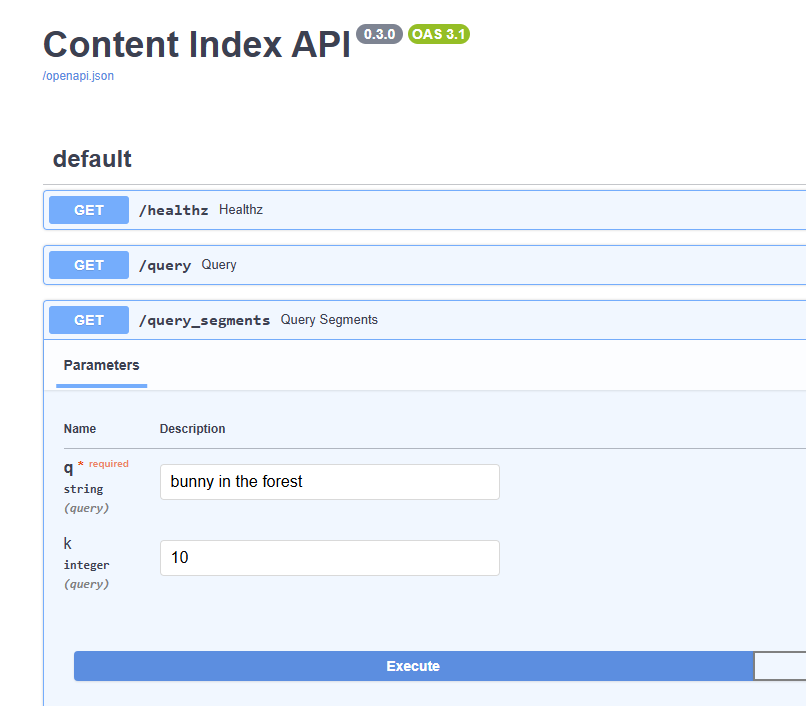
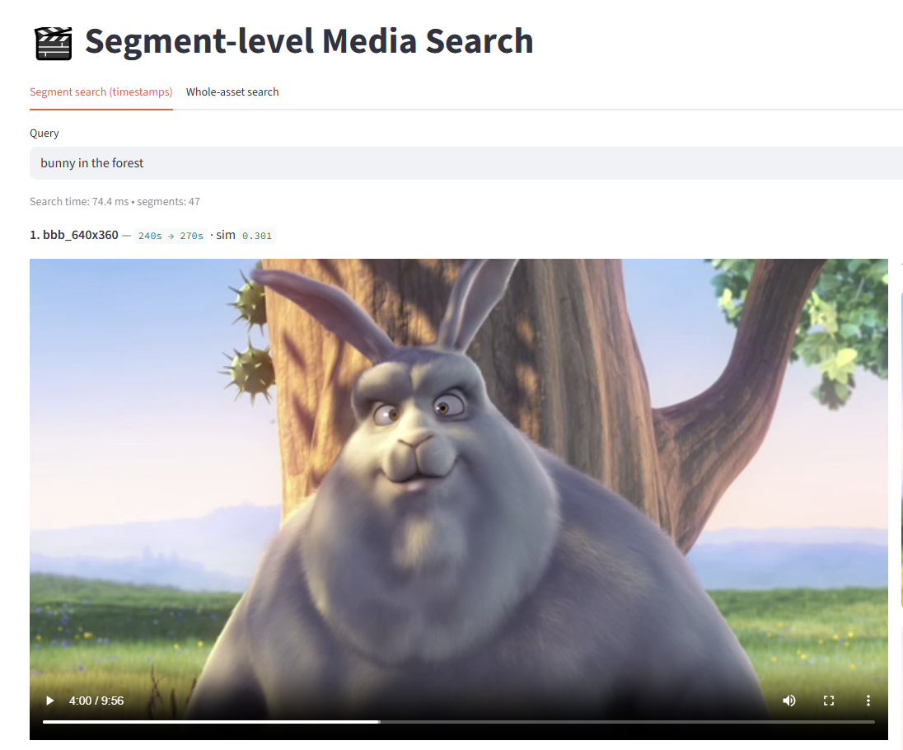
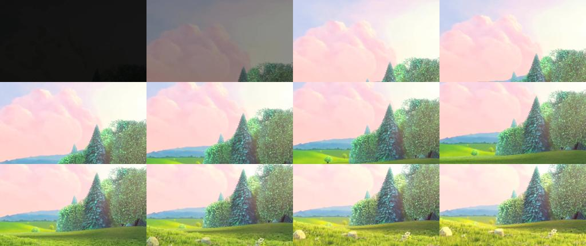
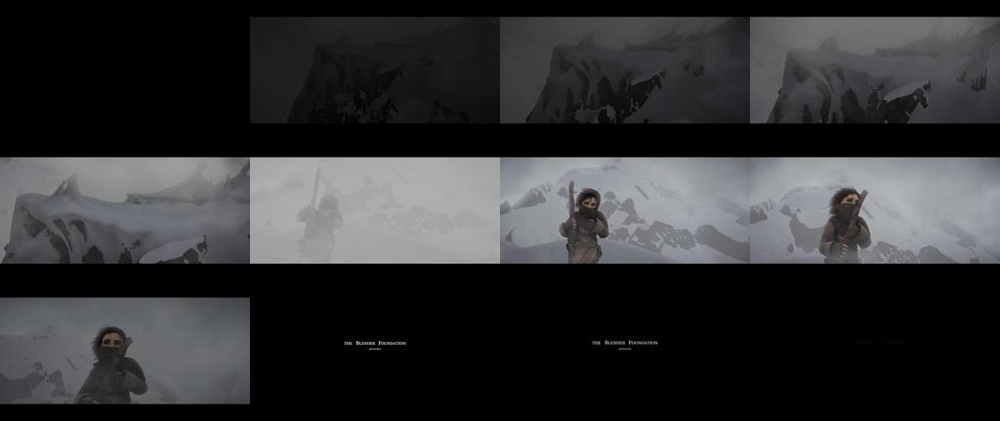
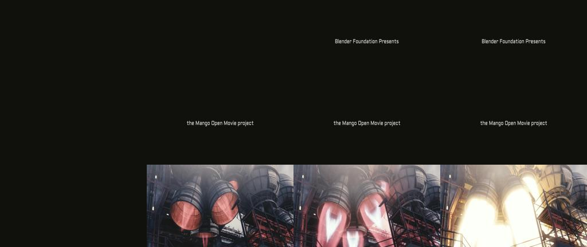

# Content Index — Multimodal Segment Search (OpenCLIP + Whisper + Faiss)

A tiny media search engine. It ingests videos, extracts 1 fps frames and audio, transcribes speech to text, embeds visuals and text, builds a vector index, and serves semantic search.  
Bonus: segment-level retrieval (30-second windows) and a Streamlit viewer with thumbnails, jump-to-time, and GIF export.

---

## Screenshots (from docs/)

**HTTP docs page**

**Segment viewer UI**

---

## Sample results (tiny demo set)

**Top segments (GIFs)**
- Bunny / forest → 
- Spaceship / robots → 
- Snowy sword fight → 

**Contact sheets (per asset)**

---

## Live demo (replace with your links)

- HTTP docs page: https://\<PUBLIC_API_URL\>/docs  
- Segment viewer: https://\<PUBLIC_VIEWER_URL\>:8501  
On Lightning Studio, set ports 8000 (service) and 8501 (viewer) to Public.

---

## How it works

1. Preprocess: ffmpeg writes frames to `artifacts/frames/<asset>/*.jpg` and mono 16 kHz audio.
2. Speech-to-text: Whisper outputs `artifacts/transcripts/<asset>.json`.
3. Embeddings: OpenCLIP image (frames) and OpenCLIP text (transcript), fused by weight alpha, then L2-normalized.
4. Indexing: Faiss inner-product (cosine on normalized vectors).
   - Asset level: one vector per video → `artifacts/faiss_hnsw.index`, `artifacts/meta.jsonl`.
   - Segment level: 30 s windows → `artifacts/faiss_segments.index`, `artifacts/meta_segments.jsonl`.
5. Serving: FastAPI endpoints for whole assets and segments.
6. Viewing: Streamlit app to type a query, preview top segments, jump to timestamps, and export GIFs.

---

## Quickstart (copy/paste commands)

Run the HTTP service:
    
    export PYTHONPATH=.
    uvicorn src.serve.app:app --host 0.0.0.0 --port 8000
    # then open http://127.0.0.1:8000/docs (or your Studio public URL)

Send search requests:
    
    curl -s http://127.0.0.1:8000/healthz | python -m json.tool
    curl -sG --data-urlencode 'q=bunny in the forest' http://127.0.0.1:8000/query | python -m json.tool
    curl -sG --data-urlencode 'q=spaceship with robots' http://127.0.0.1:8000/query_segments | python -m json.tool

Run the viewer:
    
    streamlit run apps/segments_viewer.py --server.address 0.0.0.0 --server.port 8501

---

## HTTP endpoints

- GET `/healthz` → `{ ok, assets, asset_index_ntotal, segments, segment_index_ntotal }`
- GET `/query?q=...&k=...` → top-K whole-asset matches with similarity
- GET `/query_segments?q=...&k=...` → top-K segment matches with start/end timestamps

---

## Repo layout (key bits)

- `src/util/` — ffmpeg, preprocessing, whisper
- `src/embed/` — CLIP embedder
- `src/index/` — builders for asset and segment indexes
- `src/serve/app.py` — FastAPI service (healthz, whole-asset search, segment search)
- `apps/` — Streamlit viewer
- `artifacts/` — frames, audio, transcripts, meta files, Faiss indexes
- `docs/` — screenshots, contact sheets, GIFs, latency chart

---

## Tuning

- `alpha` (vision vs. text): higher favors visuals; lower favors transcript
- `seg_seconds`: 15–60 s windows (smaller = sharper matches, larger index)
- `frame_step`: 2–3 to subsample frames inside windows for speed
- CLIP backbone: ViT-B/32 (faster) ↔ ViT-L/14 (higher quality)

